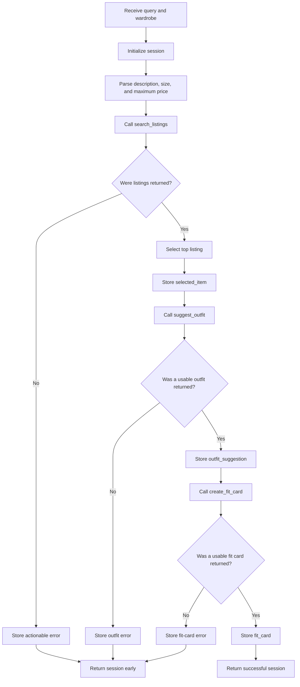

# FitFindr 

This starter kit contains everything needed to build FitFindr, a tool-using AI agent for secondhand fashion.

FitFindr accepts a natural-language request, searches a mock marketplace, recommends an outfit using the user’s wardrobe, and creates a shareable fit-card caption.

The completed project demonstrates:

* Independent tool implementation
* Conditional planning and branching
* State passing between tools
* Graceful error handling
* LLM-assisted outfit recommendations
* A Gradio user interface
* Automated tests with `pytest`

---

## What's Included

```text
ai201-project2-fitfindr-starter/
├── data/
│   ├── listings.json          # 40 mock secondhand listings
│   └── wardrobe_schema.json   # Wardrobe format + example wardrobe
├── utils/
│   └── data_loader.py         # Helper functions for loading the data
├── tests/
│   ├── test_tools.py          # Tests for the three tools
│   ├── test_agent.py          # Planning-loop and state tests
│   └── test_app.py            # Gradio handler tests
├── tools.py                   # The three FitFindr tools
├── agent.py                   # Planning loop and session state
├── app.py                     # Gradio interface
├── planning.md                # Planning and design documentation
├── README.md                  # Project documentation
└── requirements.txt           # Python dependencies
```

---

## Setup

### macOS / Linux

```bash
python -m venv .venv
source .venv/bin/activate
pip install -r requirements.txt
```

### Windows

```bash
python -m venv .venv
source .venv/Scripts/activate
pip install -r requirements.txt
```

Set your Groq API key in a `.env` file in the project root:

```text
GROQ_API_KEY=your_key_here
```

The `.env` file should not be committed to GitHub.

Run the Gradio application with:

```bash
python app.py
```

Open the URL printed in the terminal. It is usually:

```text
http://127.0.0.1:7860
```

Run all automated tests with:

```bash
python -m pytest tests/ -v
```

Current result:

```text
22 passed
```

---

## The Mock Listings Dataset

`data/listings.json` contains 40 mock secondhand listings across categories such as:

* Tops
* Bottoms
* Outerwear
* Shoes
* Accessories

The listings also cover styles such as:

* Vintage
* Y2K
* Grunge
* Cottagecore
* Streetwear
* Classic
* Minimal
* Preppy

Each listing contains:

* `id`
* `title`
* `description`
* `category`
* `style_tags`
* `size`
* `condition`
* `price`
* `colors`
* `brand`
* `platform`

Load the listings with:

```python
from utils.data_loader import load_listings

listings = load_listings()
```

---

## The Wardrobe Schema

`data/wardrobe_schema.json` defines the format FitFindr uses to represent a user’s existing wardrobe.

It includes:

* `schema`: field definitions for a wardrobe item
* `example_wardrobe`: a sample wardrobe containing 10 items
* `empty_wardrobe`: a starting template for a new user

Load the example wardrobe with:

```python
from utils.data_loader import get_example_wardrobe

wardrobe = get_example_wardrobe()
```

Load the empty wardrobe with:

```python
from utils.data_loader import get_empty_wardrobe

wardrobe = get_empty_wardrobe()
```

---

## Tool Inventory

The documented interfaces below exactly match the function signatures in `tools.py`.

### Tool 1: `search_listings`

```python
search_listings(
    description: str,
    size: str | None = None,
    max_price: float | None = None,
) -> list[dict]
```

#### Inputs

* `description: str`
  Keywords describing the requested item, such as `"vintage graphic tee"`.

* `size: str | None`
  An optional size filter. Supported examples include `M`, `S/M`, `W30`, and `US 8`.

* `max_price: float | None`
  An optional inclusive maximum price.

#### Return value

```python
list[dict]
```

The function returns matching listing dictionaries sorted from highest to lowest relevance.

It returns an empty list when no listing matches.

#### Purpose

`search_listings()` loads the local marketplace dataset, applies optional price and size filters, calculates weighted keyword overlap, removes unrelated listings, and sorts matching listings by relevance.

Matches in the title and style tags receive more weight than matches in fields such as colors or brand.

Example:

```python
results = search_listings(
    description="vintage graphic tee",
    size="M",
    max_price=30,
)
```

The highest-ranked result is:

```text
Y2K Baby Tee — Butterfly Print
```

Its listing size is `S/M`, which correctly matches the requested size `M`.

---

### Tool 2: `suggest_outfit`

```python
suggest_outfit(
    new_item: dict,
    wardrobe: dict,
) -> str
```

#### Inputs

* `new_item: dict`
  A selected listing dictionary returned by `search_listings()`.

* `wardrobe: dict`
  A wardrobe dictionary containing an `items` list.

#### Return value

```python
str
```

The function returns a non-empty outfit recommendation.

#### Purpose

`suggest_outfit()` uses Groq’s `llama-3.3-70b-versatile` model to recommend one or two outfits.

When the wardrobe contains items, the prompt instructs the model to use exact item names from the wardrobe and not invent items that the user does not own.

For example, it may combine the thrifted item with:

* `Baggy straight-leg jeans, dark wash`
* `Vintage black denim jacket`
* `Chunky white sneakers`

When the wardrobe is empty, the tool returns general styling recommendations. It clearly explains that those recommendations are not based on items the user already owns.

If the Groq request fails, the function creates a deterministic fallback recommendation instead of crashing.

---

### Tool 3: `create_fit_card`

```python
create_fit_card(
    outfit: str,
    new_item: dict,
) -> str
```

#### Inputs

* `outfit: str`
  The outfit recommendation returned by `suggest_outfit()`.

* `new_item: dict`
  The same selected listing passed into `suggest_outfit()`.

#### Return value

```python
str
```

The function returns a short social-media-style outfit caption.

#### Purpose

`create_fit_card()` creates a two-to-four-sentence caption that mentions:

* The item title
* The item price
* The marketplace platform
* The outfit vibe

A higher LLM temperature is used to create more varied captions.

If the outfit string is empty, the function returns a descriptive error message instead of raising an exception.

If the Groq request fails, the function creates a template-based fallback caption.

---

## Planning Loop

The planning loop is implemented in `agent.py` through:

```python
run_agent(query: str, wardrobe: dict) -> dict
```

FitFindr does not call all three tools unconditionally. It decides whether to continue after checking the result of each step.

### Query parsing

The agent uses deterministic regular expressions to extract:

* Item description
* Size
* Maximum price

Example input:

```text
vintage graphic tee under $30, size M
```

Parsed result:

```python
{
    "description": "vintage graphic tee",
    "size": "M",
    "max_price": 30.0,
}
```

Regex parsing was selected because the supported constraints are simple and structured. It also keeps the behavior reproducible, inexpensive, and easy to test.

### Planning-loop steps

1. Create a new session dictionary.
2. Validate the user query.
3. Parse the query into `description`, `size`, and `max_price`.
4. Store the parsed values in `session["parsed"]`.
5. Call `search_listings()` using the parsed values.
6. Store the returned listings in `session["search_results"]`.
7. Check whether the search returned any matches.
8. If no matches exist, store a helpful error and return the session immediately.
9. Otherwise, select the first ranked listing.
10. Store it in `session["selected_item"]`.
11. Pass the selected listing and stored wardrobe into `suggest_outfit()`.
12. Store the returned recommendation in `session["outfit_suggestion"]`.
13. Pass the stored outfit and the same selected listing into `create_fit_card()`.
14. Store the caption in `session["fit_card"]`.
15. Return the completed session.

### Planning-loop diagram



The most important decision occurs immediately after `search_listings()`.

When the search returns an empty list, the agent does not call `suggest_outfit()` or `create_fit_card()`.

---

## State Management

The session dictionary is the single source of truth for one interaction.

| Session field       | Purpose                                        |
| ------------------- | ---------------------------------------------- |
| `query`             | Original user query                            |
| `parsed`            | Extracted description, size, and maximum price |
| `search_results`    | Ranked listings returned by the search tool    |
| `selected_item`     | Highest-ranked listing selected by the agent   |
| `wardrobe`          | Example or empty wardrobe selected by the user |
| `outfit_suggestion` | Text returned by `suggest_outfit()`            |
| `fit_card`          | Text returned by `create_fit_card()`           |
| `error`             | Error message when the loop stops early        |
| `status`            | Current or final interaction status            |
| `tool_trace`        | Record of the tools called during the run      |

The selected listing stored in:

```python
session["selected_item"]
```

is passed directly into the outfit tool:

```python
suggest_outfit(
    session["selected_item"],
    session["wardrobe"],
)
```

The generated outfit is stored in:

```python
session["outfit_suggestion"]
```

That exact stored value is passed into the fit-card tool:

```python
create_fit_card(
    session["outfit_suggestion"],
    session["selected_item"],
)
```

The agent does not re-prompt the user or recreate intermediate values between steps.

---

## Interaction Walkthrough

### User query

```text
vintage graphic tee under $30, size M
```

### Query parsing

Before calling a tool, the agent parses the query into:

```python
{
    "description": "vintage graphic tee",
    "size": "M",
    "max_price": 30.0,
}
```

These values are stored in `session["parsed"]`.

---
### Evidence That State Passes Between Tools

The agent passes intermediate results through the session dictionary without asking the user to re-enter information.

After the search:

```python
session["selected_item"] = session["search_results"][0]
```

The exact stored listing is passed into the outfit tool:

```python
outfit = suggest_outfit(
    session["selected_item"],
    session["wardrobe"],
)
session["outfit_suggestion"] = outfit
```

The exact stored outfit and the same selected listing are then passed into the fit-card tool:

```python
fit_card = create_fit_card(
    session["outfit_suggestion"],
    session["selected_item"],
)
session["fit_card"] = fit_card
```

The automated happy-path test verifies object identity with:

```python
new_item is item
```

This confirms that the listing returned by the search is the same listing object passed into the outfit and fit-card tools, rather than a recreated or hardcoded value.

A successful tool trace is:

```text
search_listings → suggest_outfit → create_fit_card
```

For a no-results query, the trace contains only:

```text
search_listings
```

This demonstrates that the planning loop branches according to state and does not call all three tools unconditionally.

### Step 1 — Tool called

* **Tool:** `search_listings`

* **Input:**

```python
search_listings(
    description="vintage graphic tee",
    size="M",
    max_price=30.0,
)
```

* **Why this tool:**
  The agent must first find marketplace items that match the user’s description, requested size, and budget.

* **Output:**
  The search returns eight ranked listings. The highest-ranked result is:

```python
{
    "id": "lst_002",
    "title": "Y2K Baby Tee — Butterfly Print",
    "category": "tops",
    "size": "S/M",
    "price": 18.0,
    "platform": "depop",
    "style_tags": [
        "y2k",
        "vintage",
        "graphic tee",
        "cottagecore",
    ],
}
```

The size matcher recognizes that `S/M` is compatible with the requested size `M`.

The complete listing is stored in:

```python
session["selected_item"]
```

---

### Step 2 — Tool called

* **Tool:** `suggest_outfit`

* **Input:**

```python
suggest_outfit(
    new_item=session["selected_item"],
    wardrobe=session["wardrobe"],
)
```

* **Why this tool:**
  The agent found a valid listing and now needs to show how the item could work with clothing already present in the user’s wardrobe.

* **Output:**
  The tool recommends combining the baby tee with named wardrobe items such as:

```text
Baggy straight-leg jeans, dark wash
Vintage black denim jacket
Black combat boots
```

It explains that the dark colors balance the colorful butterfly print and suggests tucking the tee into the jeans to define the silhouette.

The complete recommendation is stored in:

```python
session["outfit_suggestion"]
```

---

### Step 3 — Tool called

* **Tool:** `create_fit_card`

* **Input:**

```python
create_fit_card(
    outfit=session["outfit_suggestion"],
    new_item=session["selected_item"],
)
```

* **Why this tool:**
  The agent now has both the selected listing and the completed outfit recommendation, so it can produce the final shareable caption.

* **Output:**
  The tool creates a casual caption that mentions:

```text
Y2K Baby Tee — Butterfly Print
$18
depop
```

It also describes the outfit as a playful Y2K or relaxed streetwear look.

The caption is stored in:

```python
session["fit_card"]
```

---

### Final output to user

The Gradio interface displays:

1. **Top listing panel**
   The Y2K Baby Tee listing, including price, size, condition, colors, platform, style tags, and description.

2. **Outfit panel**
   A recommendation using exact pieces from the example wardrobe.

3. **Fit-card panel**
   A short shareable caption featuring the item, price, platform, and outfit vibe.

The final session has:

```python
session["status"] == "complete"
session["error"] is None
```

---

## Error Handling and Fail Points

| Tool              | Failure mode                                              | Agent response                                                                                                                                                                                                                            |
| ----------------- | --------------------------------------------------------- | ----------------------------------------------------------------------------------------------------------------------------------------------------------------------------------------------------------------------------------------- |
| `search_listings` | The filters and description produce no matching listings. | The tool returns `[]`. The planning loop stores an actionable message in `session["error"]`, recommends broadening the description, removing the size filter, or increasing the price, and returns early without calling the other tools. |
| `suggest_outfit`  | The user has an empty wardrobe.                           | The tool returns useful general styling advice and clearly explains that the recommendations are not based on saved wardrobe items.                                                                                                       |
| `create_fit_card` | The outfit input is empty or contains only whitespace.    | The tool returns a descriptive message explaining that the outfit suggestion is missing or empty. It does not raise a Python exception.                                                                                                   |

### Concrete tested example

The following search was deliberately triggered:

```python
search_listings(
    "designer ballgown",
    size="XXS",
    max_price=5,
)
```

The tool returned:

```python
[]
```

The full agent then returned:

```text
I couldn't find any listings for 'designer ballgown' in size XXS under $5.
Try using a broader description, removing the size filter, or increasing the
maximum price.
```

The state after the failed search contained:

```python
session["search_results"] == []
session["selected_item"] is None
session["outfit_suggestion"] is None
session["fit_card"] is None
```

The tool trace contained only `search_listings`, proving that the planning loop stopped before calling the remaining tools.

### External LLM failure

Both LLM-powered tools include deterministic fallback behavior.

If the Groq call fails:

* `suggest_outfit()` creates a basic outfit using wardrobe items.
* `create_fit_card()` creates a template-based caption.

This allows FitFindr to return a useful result even when the external model is temporarily unavailable.

---

## Gradio Interface

The user interface is implemented in `app.py`.

The `handle_query()` function:

1. Checks whether the query is empty.
2. Selects either the example wardrobe or the empty wardrobe.
3. Calls `run_agent()`.
4. Checks `session["error"]`.
5. Returns an error in the first panel when the run ends early.
6. Otherwise formats the selected listing and returns all three outputs.

The three output panels are:

* Top listing found
* Outfit idea
* Fit card

For a successful query, all three panels populate.

For a no-results query, only the first panel contains the error message. The outfit and fit-card panels remain empty.

---

## Testing

The project includes tests for the individual tools, planning loop, state management, branching, and Gradio handler.

### Tool tests

`tests/test_tools.py` verifies:

* Search returns results
* Empty search behavior
* Price filtering
* Combined sizes such as `S/M`
* Empty descriptions
* Outfit generation with a populated wardrobe
* Empty-wardrobe behavior
* Missing listing behavior
* LLM failure fallbacks
* Caption generation
* Empty-outfit handling

### Agent tests

`tests/test_agent.py` verifies:

* Complete query parsing
* Query parsing without a size
* State passing between tools
* The exact selected listing reaches the outfit tool
* The stored outfit reaches the fit-card tool
* The no-results branch stops before the remaining tools
* The fit-card tool is not called after an outfit failure
* Empty queries return early

### Application tests

`tests/test_app.py` verifies:

* Empty query handling
* Successful session mapping
* Error session mapping

Run the full suite with:

```bash
python -m pytest tests/ -v
```

Result:

```text
22 passed
```

---

## Spec Reflection

### One way `planning.md` helped during implementation

`planning.md` helped define the order of the three tools and the state that needed to pass between them before implementation began. In particular, the diagram and state table made it clear that the agent must inspect the result from `search_listings()` before deciding whether to continue.

The planning document also prevented the implementation from becoming a fixed pipeline that always called all three tools. It provided a clear early-return path for no-results searches and identified which session fields should remain `None` when the agent stops.

### One divergence from the spec, and why

The original plan focused mainly on the required session fields, but the final implementation added `status` and `tool_trace`. These fields were added because they make it easier to inspect the agent’s current state, verify which tools were actually called, and prove that the no-results path stops after the search tool.

The implementation also added deterministic fallback responses for Groq failures. This goes beyond the minimum required failure cases, but it improves reliability by allowing the application to return useful output when the external API is unavailable.

---

## AI Usage

I used ChatGPT as a supporting tool for brainstorming, code review, debugging, and test design. I remained responsible for the project architecture, implementation decisions, integration, corrections, and final verification. I did not use AI-generated suggestions without reviewing them against the project specification and testing them locally.

### Instance 1: Assistance with the three tool implementations

#### What I provided to the AI tool

I shared:

* The original `tools.py` starter file
* The required function signatures
* My Tool Specifications from `planning.md`
* The listing and wardrobe data formats
* The required success and failure behavior for each tool

I asked for guidance on implementing keyword-based search, size matching, prompts for the two LLM-powered tools, and isolated tests.

#### How I used the assistance

The AI suggested possible helper functions, prompt structures, and test cases. I reviewed those suggestions and integrated only the parts that matched my specification and the starter interfaces.

I personally verified and corrected:

* Loading the `.env` file from the project root
* Matching requested size `M` with listing size `S/M`
* Ranking relevant listings correctly
* Handling empty descriptions and invalid prices
* Returning useful results when the wardrobe is empty
* Returning deterministic fallbacks when the Groq call fails

I manually ran each tool and created automated tests before connecting the tools through the agent.

### Instance 2: Assistance with the planning loop and state management

#### What I provided to the AI tool

I shared:

* My Architecture Diagram
* My Planning Loop specification
* My State Management specification
* The original `agent.py` and `app.py` TODOs
* The required happy-path and no-results behaviors

I asked for implementation guidance that preserved the session structure, passed state directly between tools, and stopped early when no listings were returned.

#### How I used the assistance

The AI suggested a regex-based query parser, conditional branches, state updates, and tests for the agent and interface. I reviewed the suggestions against my planning document and incorporated them into the starter code.

During implementation and testing, I identified and corrected:

* A parser issue that retained the unnecessary article `a`
* A mocked function-call parameter mismatch
* Markdown formatting accidentally copied into a Python test file
* The exact state-passing behavior expected by the rubric

I verified that the selected listing stored in `session["selected_item"]` is the same object passed into `suggest_outfit()`, and that `session["outfit_suggestion"]` is passed directly into `create_fit_card()`.

### Instance 3: Assistance with failure-mode testing

#### What I provided to the AI tool

I shared the Milestone 5 failure requirements and described the error handling already implemented in my tools and planning loop.

I asked for test commands that would deliberately trigger:

* No matching listings
* An empty wardrobe
* An empty outfit string

#### How I used the assistance

The AI suggested commands and assertions for triggering these cases. I ran every command locally, examined the actual state returned by the agent, and confirmed that the behavior matched the specification.

I verified that the no-results branch:

* Stores an actionable error message
* Leaves `selected_item` as `None`
* Leaves `outfit_suggestion` as `None`
* Leaves `fit_card` as `None`
* Stops after `search_listings()` instead of calling all tools

I also ran the complete test suite and confirmed that all 22 tests passed.

---


## Where to Start

1. Read `planning.md` to understand the planned tools, state, and branching behavior.
2. Verify the data loads correctly:

```bash
python utils/data_loader.py
```

3. Run the tool and agent tests:

```bash
python -m pytest tests/ -v
```

4. Start the Gradio interface:

```bash
python app.py
```

5. Test a successful query:

```text
vintage graphic tee under $30, size M
```

6. Test the no-results branch:

```text
designer ballgown size XXS under $5
```

---

