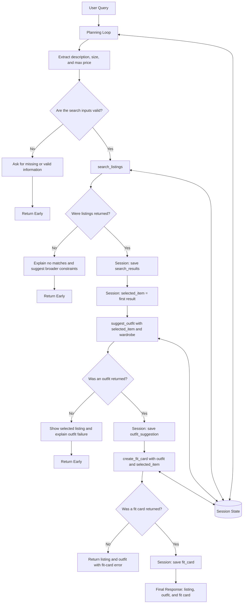

# FitFindr — planning.md

> Complete this document before writing any implementation code.
> Your spec and agent diagram are what you'll use to direct AI tools (Claude, Copilot, etc.) to generate your implementation — the more specific they are, the more useful the generated code will be.
> Your planning.md will be reviewed as part of your submission.
> Update it before starting any stretch features.

---

## Tools

List every tool your agent will use. For each tool, fill in all four fields.
You must have at least 3 tools. The three required tools are listed — add any additional tools below them.

### Tool 1: search_listings

**What it does:**

Searches the mock secondhand-listings dataset for clothing that matches the user's description, requested size, and maximum price. It compares the request with fields such as the listing title, description, category, style tags, colors, and brand, then returns the strongest matches first.

**Input parameters:**

* `description` (`str`): A natural-language description of the item the user wants, such as `"vintage graphic tee"` or `"black leather jacket"`.
* `size` (`str`): The requested clothing size, such as `"S"`, `"M"`, `"L"`, or `"8"`. The size comparison should be case-insensitive. An empty string means the user did not provide a size.
* `max_price` (`float`): The highest price the user is willing to pay. Listings priced above this value are excluded.

**What it returns:**

The tool returns a list of matching listing dictionaries sorted by relevance. Each result contains the original listing fields:

* `id`
* `title`
* `description`
* `category`
* `style_tags`
* `size`
* `condition`
* `price`
* `colors`
* `brand`
* `platform`

The most relevant result appears first in the list. If no listings match the user's constraints, the function returns an empty list.

**What happens if it fails or returns nothing:**

If the tool returns an empty list, the agent does not call `suggest_outfit()` or `create_fit_card()`. It tells the user which constraints produced no results and suggests increasing the budget, removing the size filter, or using a broader item description.

Example response:

> I couldn't find a vintage graphic tee in size M under $30. Try increasing your budget, removing the size filter, or using a broader description such as "graphic tee."

If the dataset cannot be loaded, the function handles the exception instead of crashing the agent. The agent explains that it could not access the listings and stops the workflow.

---

### Tool 2: suggest_outfit

**What it does:**

Creates a complete outfit suggestion using the selected secondhand listing and compatible pieces from the user's existing wardrobe. It considers the new item's category, colors, and style tags when selecting wardrobe pieces.

**Input parameters:**

* `new_item` (`dict`): The listing selected from the results returned by `search_listings()`. It contains information such as the title, category, colors, style tags, size, price, condition, and platform.
* `wardrobe` (`dict`): The user's current wardrobe using the structure defined in `data/wardrobe_schema.json`. During testing, the wardrobe can come from `get_example_wardrobe()` or `get_empty_wardrobe()`.

**What it returns:**

The tool returns a string containing one complete outfit suggestion. The suggestion includes:

* The selected secondhand item.
* One or more compatible wardrobe pieces.
* A short styling instruction.
* A brief explanation of why the pieces work together.

Example return value:

> Pair the Faded Band Tee with your wide-leg blue jeans and black chunky sneakers for a relaxed 90s grunge look. Roll the sleeves once and use a small front tuck to give the oversized tee more shape.

**What happens if it fails or returns nothing:**

If the wardrobe is empty, the tool does not invent items that the user owns. It returns a general styling suggestion using clearly labeled recommended basics.

Example response:

> Your saved wardrobe is empty, so I can't create a fully personalized outfit yet. A general option would be to style the Faded Band Tee with relaxed jeans and neutral sneakers.

If the wardrobe contains only one useful item, the tool uses that item and labels any other clothing as a suggested basic rather than an owned item.

If `new_item` is missing or does not contain enough information, the agent tells the user that it cannot create a reliable outfit and stops before calling `create_fit_card()`.

If the LLM call fails, the tool catches the error and returns a simpler rule-based suggestion based on the new item's category, colors, and the available wardrobe pieces.

---

### Tool 3: create_fit_card

**What it does:**

Turns the outfit suggestion and selected listing into a short, shareable social-media caption. The caption should sound casual and specific to the outfit rather than like a product description.

**Input parameters:**

* `outfit` (`str`): The complete outfit suggestion returned by `suggest_outfit()`.
* `new_item` (`dict`): The selected secondhand listing, including details such as its title, price, platform, colors, and style tags.

**What it returns:**

The tool returns a short string that can be used as a social-media outfit caption. It should mention at least one detail from the selected listing and one detail from the outfit.

Example return value:

> faded band tee, baggy denim, and chunky sneakers 🖤 this $22 Depop find brings the easiest 90s energy

Different item and outfit inputs should produce different fit cards.

**What happens if it fails or returns nothing:**

If the outfit or selected item is missing, the tool returns an empty string. The agent still shows the listing and any available outfit recommendation, but explains that it could not create the fit card.

If the LLM call fails, the tool creates a template-based fallback using the available listing and outfit information.

Example fallback:

> Faded Band Tee from Depop for $22, styled with wide-leg jeans and chunky sneakers. An easy 90s-inspired look.

---

### Additional Tools (if any)

No additional tools are planned for the required version of FitFindr. Stretch-feature tools will only be added after the three required tools and planning loop are implemented and tested.

---

## Planning Loop

**How does your agent decide which tool to call next?**

The agent uses the current session state and the result of the previous tool to decide which action to take next.

1. The agent receives the user's natural-language request.

2. It extracts the following search parameters:

   * `description`
   * `size`
   * `max_price`

3. The agent validates the extracted values.

   * If the item description is missing, it asks the user what kind of item they are searching for and stops.
   * If the maximum price is invalid or negative, it asks the user to provide a valid positive budget and stops.
   * If the size is not provided, the agent may search without a size restriction.

4. The agent calls:

   ```python
   search_listings(description, size, max_price)
   ```

5. After `search_listings()` returns, the agent checks the result.

   * If the returned list is empty, the agent sets the session status to `"no_results"`.
   * It tells the user that no listings matched the current description, size, and budget.
   * It suggests broadening the description, removing the size filter, or increasing the budget.
   * It returns early and does not call the other tools.

6. If listings are returned:

   * The full result list is stored in `session["search_results"]`.
   * The first and most relevant result is stored in `session["selected_item"]`.

7. The agent checks whether `selected_item` contains enough information for styling.

   * If the item is missing or incomplete, the agent explains the problem and stops.
   * Otherwise, it calls:

   ```python
   suggest_outfit(selected_item, wardrobe)
   ```

8. After `suggest_outfit()` returns, the agent checks the result.

   * If an empty string is returned, the agent shows the selected listing but explains that it could not create an outfit.
   * It then stops without calling `create_fit_card()`.
   * If a valid outfit is returned, the result is stored in `session["outfit_suggestion"]`.

9. If the wardrobe is empty, the agent can continue as long as `suggest_outfit()` returns a general outfit suggestion. It also stores a message explaining that the recommendation uses suggested basics and is not fully personalized.

10. The agent calls:

```python
create_fit_card(outfit_suggestion, selected_item)
```

11. After `create_fit_card()` returns:

* If a caption is returned, it is stored in `session["fit_card"]`.
* The session status is changed to `"complete"`.
* If an empty string is returned, the agent keeps the listing and outfit but explains that the fit card could not be generated.

12. The workflow ends when:

* A listing, outfit, and fit card have been produced, or
* A failure condition causes the agent to stop early.

The agent therefore does not call all three tools automatically. Each tool call depends on whether the previous tool returned valid and useful information.

For query parsing, I use deterministic regular expressions rather than an
additional LLM call. The parser extracts phrases such as `under $30` and
`size M`, removes them from the query, and treats the remaining cleaned text
as the listing description. This keeps parsing reproducible and avoids an
extra API call.
---

## State Management

**How does information from one tool get passed to the next?**

The agent stores information in a session dictionary during a single user interaction.

Example session structure:

```python
session = {
    "user_query": "",
    "description": "",
    "size": "",
    "max_price": None,
    "wardrobe": {},
    "search_results": [],
    "selected_item": None,
    "outfit_suggestion": "",
    "fit_card": "",
    "status": "started",
    "messages": [],
    "errors": []
}
```

Information moves through the session as follows:

1. The original user request is stored in:

   ```python
   session["user_query"]
   ```

2. The extracted search values are stored in:

   ```python
   session["description"]
   session["size"]
   session["max_price"]
   ```

3. The user's wardrobe is stored in:

   ```python
   session["wardrobe"]
   ```

4. The list returned by `search_listings()` is stored in:

   ```python
   session["search_results"]
   ```

5. The first and most relevant listing is stored in:

   ```python
   session["selected_item"]
   ```

6. The planning loop passes `session["selected_item"]` and `session["wardrobe"]` to `suggest_outfit()`.

7. The outfit string returned by `suggest_outfit()` is stored in:

   ```python
   session["outfit_suggestion"]
   ```

8. The planning loop passes `session["outfit_suggestion"]` and `session["selected_item"]` to `create_fit_card()`.

9. The resulting caption is stored in:

   ```python
   session["fit_card"]
   ```

10. The planning loop updates `session["status"]` to values such as:

* `"started"`
* `"no_results"`
* `"listing_selected"`
* `"outfit_created"`
* `"complete"`
* `"error"`

The user does not need to re-enter the selected item or outfit because the session preserves the outputs of earlier tool calls.

---
### Milestone 4 Implementation Notes

#### Query Parsing

I implemented deterministic query parsing with regular expressions rather than using an additional LLM call. The parser extracts optional constraints such as `under $30` and `size M`, removes those phrases from the query, and uses the remaining cleaned text as the listing description.

For example:

```text
Input: vintage graphic tee under $30, size M
Parsed:
- description: vintage graphic tee
- size: M
- max_price: 30.0
```

This approach keeps parsing reproducible, fast, and inexpensive.

#### Planning Loop

The implemented planning loop follows these steps:

1. Create a new session dictionary for the interaction.
2. Parse the user query into `description`, `size`, and `max_price`.
3. Call `search_listings()` and store the returned list in `session["search_results"]`.
4. If the search returns no results, store a helpful message in `session["error"]` and return immediately.
5. Otherwise, select the first ranked result and store it in `session["selected_item"]`.
6. Pass that exact selected-item dictionary and `session["wardrobe"]` into `suggest_outfit()`.
7. Store the returned text in `session["outfit_suggestion"]`.
8. Pass the stored outfit suggestion and the same selected-item dictionary into `create_fit_card()`.
9. Store the result in `session["fit_card"]` and return the completed session.

The loop does not call all three tools unconditionally. Each step runs only when the previous step produced valid data.

#### State Management

The session dictionary is the single source of truth for one interaction. It contains:

* `query`: original user query
* `parsed`: extracted description, size, and maximum price
* `search_results`: ranked matching listings
* `selected_item`: the top-ranked listing
* `wardrobe`: selected user wardrobe
* `outfit_suggestion`: result returned by `suggest_outfit()`
* `fit_card`: result returned by `create_fit_card()`
* `error`: explanation when the loop terminates early
* `status`: current or final interaction status
* `tool_trace`: record of tools called during the interaction

State is passed directly between tools. The selected listing is not recreated or hardcoded, and the outfit suggestion stored in the session is the same value passed into the fit-card tool.

#### Branching Behavior

The agent behaves differently depending on the search result:

* When listings are found, the loop calls all three tools and produces a listing, outfit suggestion, and fit card.
* When no listings are found, the loop stops after `search_listings()`. In this branch, `selected_item`, `outfit_suggestion`, and `fit_card` remain `None`.

#### Verification

I verified the implementation using automated and manual tests:

* All 22 pytest tests passed.
* The successful CLI path parsed the query, selected the correct listing, generated an outfit, and created a fit card.
* The query `vintage graphic tee under $30, size M` selected the `Y2K Baby Tee — Butterfly Print` listing with size `S/M`.
* The no-results query `designer ballgown size XXS under $5` returned an error and left the outfit and fit-card values empty.
* The Gradio interface displayed all three outputs for a successful query and only the error panel for the no-results branch.

#### AI Assistance

I provided my planning-loop diagram, Planning Loop specification, and State Management specification to ChatGPT for implementation guidance. I reviewed the generated suggestions, integrated them into the starter structure, corrected the query parsing and function-call issues found during testing, and verified the final behavior with automated tests, CLI tests, and the Gradio interface.


### Milestone 5: Failure-Mode Verification

I deliberately triggered and verified the three required failure modes:

1. **No matching listings:**
   Searching for `designer ballgown size XXS under $5` returned an empty list. The full agent stored a specific and actionable message in `session["error"]`, left `selected_item`, `outfit_suggestion`, and `fit_card` as `None`, and stopped before calling the outfit and fit-card tools.

2. **Empty wardrobe:**
   Calling `suggest_outfit()` with an empty wardrobe returned useful general styling advice. The response clearly explained that the recommendations were not based on saved wardrobe items.

3. **Empty outfit:**
   Calling `create_fit_card()` with an empty outfit string returned a descriptive error message instead of raising a Python exception.

I documented the no-results branch with a screenshot for the project demonstration.


## Error Handling

For each tool, describe the specific failure mode you're handling and what the agent does in response.

| Tool              | Failure mode                          | Agent response                                                                                                                                                                                                          |
| ----------------- | ------------------------------------- | ----------------------------------------------------------------------------------------------------------------------------------------------------------------------------------------------------------------------- |
| `search_listings` | No results match the query            | The agent says which description, size, and maximum price produced no matches. It suggests increasing the budget, removing the size filter, or using a broader search phrase. It stops without calling the other tools. |
| `suggest_outfit`  | Wardrobe is empty                     | The agent explains that the wardrobe is empty and provides a general outfit using suggested basics. It does not claim that the user owns those items.                                                                   |
| `create_fit_card` | Outfit input is missing or incomplete | The agent returns the available listing and outfit information, explains that it could not create the shareable caption, and uses a template-based fallback when enough information is available.                       |

Additional error cases:

| Tool or component | Failure mode                   | Agent response                                                                                                                                                      |
| ----------------- | ------------------------------ | ------------------------------------------------------------------------------------------------------------------------------------------------------------------- |
| Planning loop     | Item description is missing    | The agent asks what kind of item the user wants, such as a tee, jacket, dress, or pair of jeans.                                                                    |
| Planning loop     | Maximum price is invalid       | The agent asks the user to provide a positive numeric budget.                                                                                                       |
| `search_listings` | Listings file cannot be loaded | The agent explains that the listings dataset could not be accessed and stops the workflow.                                                                          |
| `suggest_outfit`  | Selected listing is incomplete | The agent explains that the listing does not contain enough information to create a reliable outfit and stops before creating a fit card.                           |
| `suggest_outfit`  | LLM call fails                 | The tool returns a simpler rule-based suggestion using the item category, colors, and available wardrobe pieces.                                                    |
| `create_fit_card` | LLM call fails                 | The tool returns a template-based caption using the listing title, price, platform, and outfit information.                                                         |
| Planning loop     | A tool returns unexpected data | The agent keeps the valid results already produced, explains that one step returned an unexpected result, and stops before passing unreliable data to another tool. |

---
## Milestone 6: Final Verification

The completed implementation matches the main design in this planning document:

* The agent parses the natural-language query into a description, optional size, and optional maximum price.
* The planning loop branches after `search_listings()` and stops early when no listings are returned.
* The selected listing is stored in `session["selected_item"]` and passed directly into `suggest_outfit()`.
* The returned outfit is stored in `session["outfit_suggestion"]` and passed directly into `create_fit_card()`.
* The successful Gradio path populates all three output panels.
* The no-results path displays an actionable error and leaves the outfit and fit-card panels empty.
* All 22 automated tests pass.
* The required failure modes were triggered manually and produced informative responses.

The final README documents the tool interfaces, planning loop, state management, error handling, implementation reflection, and specific uses of AI assistance. The demo video shows a complete three-tool interaction, state passing, and the no-results branch.

## Architecture



The planning loop controls which tool is called next. Session state stores the results between tool calls. The search result becomes the input to the outfit tool, and the outfit result becomes the input to the fit-card tool. Error branches stop the workflow before empty or invalid information is passed to another tool.

---

## AI Tool Plan

**Milestone 3 — Individual tool implementations:**

I will implement the three required tools myself using the specifications in this document and the helper functions provided in the starter repository. I will use ChatGPT as an assistant when I need help reviewing logic, identifying edge cases, debugging errors, or improving part of the implementation.

For `search_listings()`, I will first write the filtering and ranking logic using:

* The Tool 1 specification.
* The fields in `data/listings.json`.
* `load_listings()` from `utils/data_loader.py`.

I may provide my implementation to ChatGPT and ask it to review whether:

* All three parameters are used correctly.
* The text search checks the relevant listing fields.
* Size comparisons are case-insensitive.
* The maximum-price filter is applied.
* The empty-results case is handled correctly.

I will verify the function by testing:

1. A query that returns several matches.
2. A query with strict size and price constraints.
3. A query that returns no matches.

For `suggest_outfit()`, I will implement the function using:

* The Tool 2 specification.
* `data/wardrobe_schema.json`.
* `get_example_wardrobe()`.
* `get_empty_wardrobe()`.

I will use ChatGPT to review whether the function uses only items that actually exist in the provided wardrobe and whether the empty-wardrobe response is useful and honest.

I will test it with:

1. A populated example wardrobe.
2. An empty wardrobe.
3. A minimal wardrobe containing only one useful item.
4. An incomplete `new_item`.

For `create_fit_card()`, I will write the prompt and fallback logic using the Tool 3 specification. I may use ChatGPT to help improve the prompt if captions are too generic, too long, or unrelated to the outfit.

I will test it with at least two different listing-and-outfit combinations and confirm that:

* The captions are different.
* Each caption uses details from its specific inputs.
* The caption is short and shareable.
* The fallback works when the LLM call fails.

I will test each tool independently before connecting the tools to the agent.

**Milestone 4 — Planning loop and state management:**

I will implement the planning loop and session-state structure using:

* The Planning Loop section.
* The State Management section.
* The Error Handling tables.
* The Architecture diagram.
* The tool interfaces defined above.

I will use ChatGPT as a review and debugging assistant. For example, I may share my planning-loop implementation and ask it to check whether every conditional branch matches the diagram or help explain an error I encounter.

I expect the completed planning loop to:

* Initialize the session state.
* Call `search_listings()` first.
* Stop when no listings are returned.
* Store the selected listing in the session.
* Pass the listing and wardrobe to `suggest_outfit()`.
* Stop when no outfit is available.
* Pass the outfit and selected listing to `create_fit_card()`.
* Return all valid results and useful error messages.

I will verify the implementation myself by checking that:

* `search_listings()` is always called first.
* `suggest_outfit()` is not called when search results are empty.
* The selected listing is stored before the outfit tool is called.
* `create_fit_card()` is not called when no outfit exists.
* Information passes through session state without requiring the user to enter it again.
* Each failure produces a specific and actionable response.

I will run at least three complete end-to-end tests:

1. A successful interaction using all three tools.
2. A search with no results that terminates early.
3. A successful search using an empty wardrobe.

I will use the test results to correct my implementation before documenting the final behavior in the README.

---
### AI Tool Plan and Verification

For tool implementation, I supplied the AI assistant with the three Tool Specification sections from this planning document, the required function signatures from `tools.py`, the listing and wardrobe data formats, and the Error Handling table. I asked it to propose implementations and isolated tests that preserved the starter interfaces.

For the planning loop, I supplied the Architecture Diagram, Planning Loop section, State Management section, and the original `agent.py` and `app.py` TODOs. I instructed the AI assistant to generate a conditional workflow that stores intermediate values in the session dictionary and returns early when no listings are found.

I did not use the generated suggestions without review. I verified them by:

* Comparing every function signature with the starter specification
* Manually testing all three tools
* Checking that size `M` matches `S/M`
* Checking that no results produce an early return
* Using mocked tests to verify that the same listing object passes between tools
* Verifying that the stored outfit passes into `create_fit_card()`
* Correcting the parser when it retained an unnecessary article
* Correcting a mocked function-call mismatch
* Running the complete test suite and confirming that all 22 tests pass
* Testing both successful and no-results paths in Gradio

## A Complete Interaction (Step by Step)

Write out what a full user interaction looks like from start to finish — tool call by tool call. Use a specific example query.

FitFindr interprets the user's request and first calls `search_listings()` using the requested item description, size, and maximum price. When a matching listing is found, the agent saves the selected item in the current session, passes it with the user's wardrobe to `suggest_outfit()`, and then sends the resulting outfit to `create_fit_card()` to produce a shareable caption. If a search returns no useful matches or another tool fails, the agent explains what happened and either suggests changing the request or asks for missing information instead of continuing with invalid data.

**Example user query:**

> I'm looking for a vintage graphic tee under $30, size M. I mostly wear baggy jeans and chunky sneakers. What's out there and how would I style it?

**Step 1:**

The planning loop receives the user's request and extracts:

```python
description = "vintage graphic tee"
size = "M"
max_price = 30.0
```

It stores the original query and extracted parameters in the session.

The planning loop calls:

```python
search_listings(
    description="vintage graphic tee",
    size="M",
    max_price=30.0
)
```

The tool searches the mock dataset and returns a list of matching listing dictionaries sorted by relevance.

Example first result:

```python
{
    "id": "listing-12",
    "title": "Faded Band Tee",
    "description": "Soft vintage-style graphic band shirt.",
    "category": "tops",
    "style_tags": ["vintage", "graphic", "grunge"],
    "size": "M",
    "condition": "Good",
    "price": 22.0,
    "colors": ["black", "gray"],
    "brand": "Unknown",
    "platform": "Depop"
}
```

The planning loop stores the returned list in:

```python
session["search_results"]
```

It selects the first result and stores it in:

```python
session["selected_item"]
```

If the search had returned an empty list, the agent would stop here and tell the user how to broaden the search.

**Step 2:**

Because a valid listing was found, the planning loop calls:

```python
suggest_outfit(
    new_item=session["selected_item"],
    wardrobe=session["wardrobe"]
)
```

The tool examines the selected tee and the available wardrobe items.

Example return value:

> Pair the Faded Band Tee with your wide-leg blue jeans and black chunky sneakers for a relaxed 90s grunge look. Roll the sleeves once and use a small front tuck to give the oversized tee more shape.

The planning loop stores the result in:

```python
session["outfit_suggestion"]
```

If the wardrobe were empty, the tool would return a general suggestion using clearly labeled recommended basics rather than claiming that the user owns them.

**Step 3:**

Because a valid outfit was returned, the planning loop calls:

```python
create_fit_card(
    outfit=session["outfit_suggestion"],
    new_item=session["selected_item"]
)
```

The tool uses details from the selected listing and outfit to create a short shareable caption.

Example return value:

> faded band tee, baggy denim, and chunky sneakers 🖤 this $22 Depop find brings the easiest 90s energy

The planning loop stores the result in:

```python
session["fit_card"]
```

It then sets:

```python
session["status"] = "complete"
```

**Final output to user:**

```text
Top match

Faded Band Tee
Price: $22
Size: M
Condition: Good
Platform: Depop

Outfit suggestion

Pair the Faded Band Tee with your wide-leg blue jeans and black
chunky sneakers for a relaxed 90s grunge look. Roll the sleeves
once and use a small front tuck to give the oversized tee more shape.

Fit card

"faded band tee, baggy denim, and chunky sneakers 🖤 this $22
Depop find brings the easiest 90s energy"
```

This interaction uses all three required tools in sequence. The selected listing and outfit are passed between tools through session state, so the user does not need to repeat any information.

If the search returns no results, the agent stops after Step 1 and responds with a message such as:

> I couldn't find a vintage graphic tee in size M under $30. Try increasing your budget, removing the size filter, or searching for the broader phrase "graphic tee."
